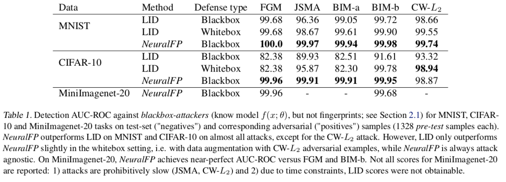
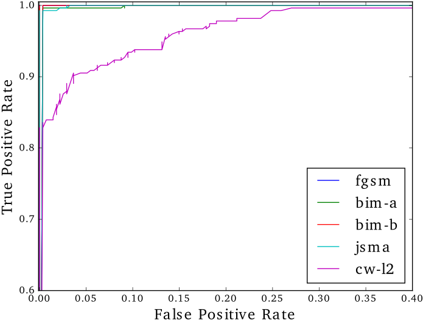

# Detecting Adversarial Examples via Neural Fingerprinting


This is code that implements *Neural Fingerprinting*, a technique to detect adversarial examples.

This accompanies the paper **Detecting Adversarial Examples via Neural Fingerprinting**, *Sumanth Dathathri(\*), Stephan Zheng(\*), Richard Murray and Yisong Yue, 2018* (\* = equal contribution), which can be found here:

[https://arxiv.org/abs/1803.03870](https://arxiv.org/abs/1803.03870)

If you use this code or work, please cite:

```bibtex
@inproceedings{dathathri_zheng_2018_neural_fingerprinting,
  title  = {Detecting Adversarial Examples via Neural Fingerprinting},
  author={Dathathri, Sumanth and Zheng, Stephan and Murray, Richard and Yue, Yisong},
  year   = {2018}
  eprint = {1803.03870}
  ee     = {https://arxiv.org/abs/1803.03870}
}
```

To clone the repository, run:

```
git clone https://github.com/StephanZheng/neural-fingerprinting
cd neural-fingerprinting
```

## Results

Neural Fingerprinting achieves near-perfect detection rates on MNIST, CIFAR and MiniImageNet-20.




ROC curves for detection of different attacks on CIFAR.

## Requirements and Installation

We have tested this codebase with the following dependencies (we cannot guarantee compatibility with other versions).

- PyTorch >= 0.2
(torch (0.2.0.post3)
torchvision (0.1.9))
- Tensorflow >=1.4.1
(tensorflow (1.4.1))
- Keras 2.0.8
- [https://github.com/gzuidhof/nn-transfer](https://github.com/gzuidhof/nn-transfer): to transfer models from Tensorflow to PyTorch.
- scikit-learn

To install these dependencies, run:

```
# PyTorch: find detailed instructions on [http://pytorch.org/](http://pytorch.org/)
pip install torch
pip install torchvision

# TF: find detailed instructions on [http://tensorflow.org/](http://tensorflow.org)
pip install keras
pip install tensorflow-gpu

# nn_transfer
git clone https://github.com/gzuidhof/nn-transfer
cd nn-transfer
pip install .

pip install sklearn
```

This codebase relies on third-party implementations for adversarial attacks and code to transfer generated attacks from Tensorflow to PyTorch.

- Local Intrinsic Dimensionality for Adversarial Subspace Detection [https://github.com/xingjunm/lid_adversarial_subspace_detection](https://github.com/xingjunm/lid_adversarial_subspace_detection): a library to generate all adversarial attacks.
- Cleverhans: [https://github.com/tensorflow/cleverhans](https://github.com/tensorflow/cleverhans): a library to generate gradient-based attacks, called by the LID code. This codebase has been included in the `third_party` folder.
- [https://github.com/rwightman/pytorch-nips2017-attack-example](https://github.com/rwightman/pytorch-nips2017-attack-example): code to generate iterative fast-gradient attacks on ImageNet examples.

## Quick-start

To train and evaluate models with fingerprints, use the launcher script `run.sh`, which contains example calls to run the code.

The flags that can be set for the launcher are:

```
./run.sh dataset train attack eval grid num_dx eps epoch_for_eval
```

where

- dataset: 'mnist', 'cifar' or 'miniimagenet'
- train: 'train' or 'notrain' -- do training or not
- attack: 'train' or 'notrain' -- create adversarial examples or not
- eval: 'eval' or 'noeval' -- do evaluation or not
- grid: 'grid' or 'nogrid' -- enables a grid search for hyperparameter tuning.
- num_dx: number of fingerprint directions
- eps: standard deviation of randomly sampled fingerprint directions
- epoch\_for\_eval: which model epoch to use for evaluation

For instance, the following command trains a convolutional neural network for MNIST with 10 fingerprints with epsilon = 0.1, and evaluates the model after 10 epochs of training:

```
./run.sh mnist train attack eval nogrid 10 0.1 10
```

## Running training, attacks and evaluation

1. To train a model with fingerprints:

```bash
NAME=mnist

LOGDIR=/tmp/nfp/$NAME/log
DATADIR=/tmp/nfp/$NAME/data
mkdir -p $LOGDIR
mkdir -p $DATADIR

NUMDX=10
EPS=0.1
NUM_EPOCHS=10

python $NAME/train_fingerprint.py \
--batch-size 128 \
--test-batch-size 128 \
--epochs $NUM_EPOCHS \
--lr 0.01 \
--momentum 0.9 \
--seed 0 \
--log-interval 10 \
--log-dir $LOGDIR \
--data-dir $DATADIR \
--eps=$EPS \
--num-dx=$NUMDX \
--num-class=10 \
--name=$NAME
```

2. Creating adversarial attacks for the model after 10 epochs of training:

```
ADV_EX_DIR=/tmp/nfp/$NAME/attacks
EPOCH=10
python $NAME/gen_whitebox_adv.py \
--attack "all" \
--ckpt $LOGDIR/ckpt/state_dict-ep_$EPOCH.pth \
--log-dir $ADV_EX_DIR \
--batch-size 128
```

3. Evaluating model

```
EVAL_LOGDIR=$LOGDIR/eval/epoch_$EPOCH
mkdir -p $EVAL_LOGDIR

python $NAME/eval_fingerprint.py \
--batch-size 128 \
--epochs 100 \
--lr 0.001 \
--momentum 0.9 \
--seed 0 \
--log-interval 10 \
--ckpt $LOGDIR/ckpt/state_dict-ep_$EPOCH.pth \
--log-dir $EVAL_LOGDIR \
--fingerprint-dir $LOGDIR \
--adv-ex-dir $ADV_EX_DIR \
--data-dir $DATADIR \
--eps=$eps \
--num-dx=$numdx \
--num-class=10 \
--name=$NAME
```
